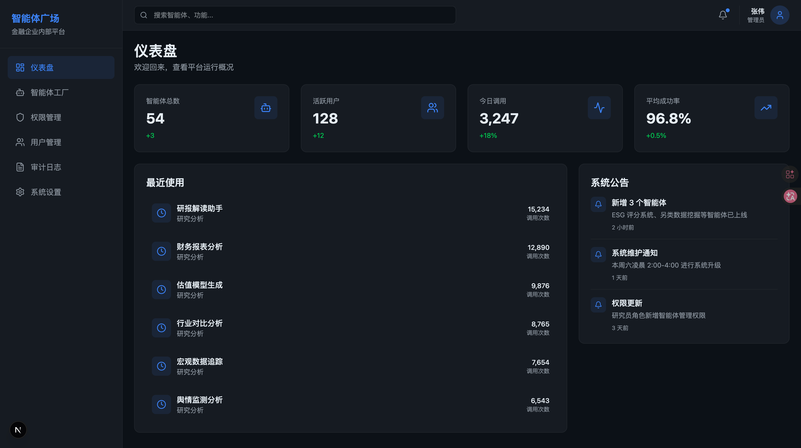
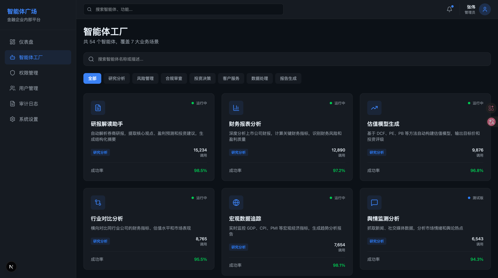

# 金融企业内部智能体广场平台

一个为金融企业内部打造的智能体工厂展示平台，包含 54 个智能体，覆盖研究分析、风险管理、合规审查、投资决策、客户服务、数据处理、报告生成七大类别。

## 系统预览

### 1. 智能体广场概览


### 2. 详细功能展示


## 技术栈

- **框架**: Next.js 16 (App Router)
- **语言**: TypeScript
- **样式**: Tailwind CSS 4.x
- **动画**: Framer Motion
- **图标**: Lucide React
- **工具**: clsx + tailwind-merge

## 项目截图

访问 http://localhost:3000 查看完整应用。

主要页面：
- 仪表盘：统计数据和最近使用
- 智能体工厂：54 个智能体卡片，支持搜索和筛选
- 智能体详情：工作流可视化、参数配置、调用历史
- 权限管理：角色和权限矩阵
- 用户管理：用户列表和信息
- 系统设置：平台配置
- 审计日志：操作记录

## 功能特性

### 1. 智能体工厂 (`/agents`)
- 54 个智能体卡片展示
- 搜索和分类筛选功能
- 响应式网格布局
- 智能体详情页面，包含：
  - 工作流可视化
  - 参数配置面板
  - 输出预览
  - 调用历史记录

### 2. 仪表盘 (`/dashboard`)
- 统计卡片（智能体总数、活跃用户、今日调用、平均成功率）
- 最近使用的智能体
- 系统公告

### 3. 权限管理 (`/permissions`)
- 角色列表（管理员、研究员、分析师、普通用户）
- 权限矩阵展示

### 4. 用户管理 (`/users`)
- 用户列表表格
- 用户信息展示

### 5. 系统设置 (`/settings`)
- 基础设置
- 安全设置

### 6. 审计日志 (`/audit`)
- 操作记录查询
- 日志筛选

## 智能体分类

| 分类 | 数量 | 代表智能体 |
|------|------|-----------|
| 研究分析 | 12 | 研报解读助手、财务报表分析、估值模型生成 |
| 风险管理 | 8 | 市场风险监控、VaR计算助手、反欺诈检测 |
| 合规审查 | 8 | AML交易监控、KYC信息核验、合同条款审查 |
| 投资决策 | 8 | 量化策略回测、投资组合优化、因子模型分析 |
| 客户服务 | 6 | 客户画像分析、产品推荐引擎、理财方案生成 |
| 数据处理 | 6 | 异常值检测、多源数据融合、实时数据监控 |
| 报告生成 | 6 | 日报自动生成、路演材料生成、监管申报材料 |

## 快速开始

### 安装依赖

```bash
npm install
```

### 启动开发服务器

```bash
npm run dev
```

访问 [http://localhost:3000](http://localhost:3000) 查看应用。

### 构建生产版本

```bash
npm run build
npm start
```

## 项目结构

```
internal-agent-plaza/
├── app/                        # Next.js App Router 页面
│   ├── layout.tsx             # 根布局
│   ├── page.tsx               # 首页（重定向到 dashboard）
│   ├── dashboard/             # 仪表盘
│   ├── agents/                # 智能体工厂
│   │   └── [id]/             # 智能体详情
│   ├── permissions/           # 权限管理
│   ├── users/                 # 用户管理
│   ├── settings/              # 系统设置
│   └── audit/                 # 审计日志
├── components/                 # React 组件
│   ├── layout/                # 布局组件
│   ├── dashboard/             # 仪表盘组件
│   ├── agents/                # 智能体组件
│   ├── permissions/           # 权限组件
│   ├── users/                 # 用户组件
│   └── ui/                    # 通用 UI 组件
└── lib/                       # 工具和数据
    ├── types.ts               # TypeScript 类型定义
    ├── utils.ts               # 工具函数
    └── data/                  # Mock 数据
        ├── agents.ts          # 54 个智能体数据
        ├── users.ts           # 用户数据
        └── permissions.ts     # 权限数据
```

## 设计规范

### 颜色主题

- 背景主色: `#0d1117`
- 卡片背景: `#161b22`
- 边框: `#21262d`
- 主品牌色: `#3b82f6` (蓝色)
- 文字主色: `#e6edf3`
- 文字次色: `#8b949e`

### 组件样式

- 卡片: 深色背景，hover 时蓝色边框发光
- 徽章: 按分类/状态区分颜色
- 动画: Framer Motion scroll-triggered，stagger 0.05s

## 路由说明

| 路径 | 页面 |
|------|------|
| `/` | 重定向到 `/dashboard` |
| `/dashboard` | 仪表盘 |
| `/agents` | 智能体工厂列表 |
| `/agents/[id]` | 智能体详情 |
| `/permissions` | 权限管理 |
| `/users` | 用户管理 |
| `/settings` | 系统设置 |
| `/audit` | 审计日志 |

## 开发说明

这是一个产品原型/设计稿项目，所有数据都是 Mock 数据。实际生产环境需要：

1. 连接真实的后端 API
2. 实现用户认证和授权
3. 添加数据持久化
4. 实现真实的智能体调用逻辑
5. 添加错误处理和加载状态
6. 优化性能和 SEO

## License

MIT
